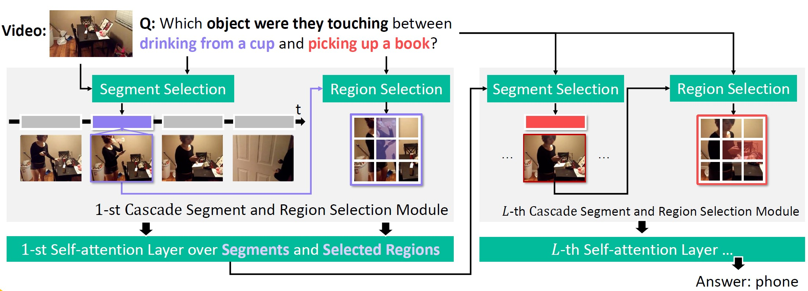

# MIST: Multi-modal Iterative Spatial-Temporal Transformer for Long-form Video Question Answering
[](LICENSE)
[](https://www.python.org/)


[[CVPR 2023](https://openaccess.thecvf.com/content/CVPR2023/papers/Gao_MIST_Multi-Modal_Iterative_Spatial-Temporal_Transformer_for_Long-Form_Video_Question_Answering_CVPR_2023_paper.pdf)]

> **MIST: Multi-modal Iterative Spatial-Temporal Transformer for Long-form Video Question Answering**
> <br>Difei Gao, Luowei Zhou, Lei Ji, Linchao Zhu, Yi Yang, Mike Zheng Shou<br>

 

## Prerequisites

The project requires the following:

1. **PyTorch** (version 1.9.0 or higher): The project was tested on PyTorch 1.11.0 with CUDA 11.3 support.
2. **Hardware**: We have performed experiments on NVIDIA GeForce A5000 with 24GB GPU memory. Similar or higher specifications are recommended for optimal performance.
3. **Python packages**: Additional Python packages specified in the `requirements.txt` file are necessary. Instructions for installing these are given below.

## Setup Instructions
Let's begin from creating and activating a Conda environment an virtual environment 
```
conda create --name mistenv python=3.7
conda activate mistenv
```
Then, clone this repository and install the requirements.
```
$ git clone https://github.com/showlab/mist.git
$ cd mist
$ pip install -r requirements.txt
```

## Data Preparation
You need to obtain necessary dataset and features. You can choose one of the following options to do so:

#### Option 1: Download Features from Our Shared Drive

You can download the dataset annotation files and features directly from our online drive:

[Download from Google Drive]()

In our experiments, we suggest placing the downloaded data folder in the same root directory as the code folder.

#### Option 2: Extract Features Using Provided Script

If you prefer, you can extract the features on your own using the provided script located in the `extract` directory:

`extract\extract_clip_features.ipynb`

This script extracts the patch features from video frames. Additionally, it includes a checking routine to verify the correctness of the extracted features.

## Training
With your environment set up and data ready, you can start training the model. To begin training, run the `agqa_v2_mist.sh` shell script located in the `shells\` directory. 
```
./shells/agqa_v2_mist.sh
```
Alternatively, input the command below on the terminal to start training.
```
CUDA_VISIBLE_DEVICES=6 python main_agqa_v2.py --dataset_dir='../data/datasets/' \
	--feature_dir='../data/feats/'  \
	--checkpoint_dir=agqa \
	--dataset=agqa \
	--mc=0 \
	--epochs=30 \
	--lr=0.00003 \
	--qmax_words=30 \
	--amax_words=38 \
	--max_feats=32 \
	--batch_size=128 \
	--batch_size_val=128 \
	--num_thread_reader=8 \
	--mlm_prob=0 \
	--n_layers=2 \
	--embd_dim=512 \
	--ff_dim=1024 \
	--feature_dim=512 \
	--dropout=0.3 \
	--seed=100 \
	--freq_display=150 \
	--save_dir='../data/save_models/agqa/mist_agqa_v2/'
```
Make sure to modify the `dataset_dir`, `feature_dir`, and `save_dir` parameters in the command above to match the locations where you have stored the downloaded data and features.

To verify that your training process is running as expected, you can refer to our training logs located in the `logs\` directory.

## Ackonwledgements
We are grateful to just-ask, an excellent VQA codebase, on which our codes are developed.

## Bibtex
```
@inproceedings{gao2023mist,
  title={MIST: Multi-modal Iterative Spatial-Temporal Transformer for Long-form Video Question Answering}, 
  author={Difei Gao and Luowei Zhou and Lei Ji and Linchao Zhu and Yi Yang and Mike Zheng Shou},
  booktitle={Proceedings of the IEEE/CVF Conference on Computer Vision and Pattern Recognition},
  pages={14773--14783},
  year={2023}
}
```
